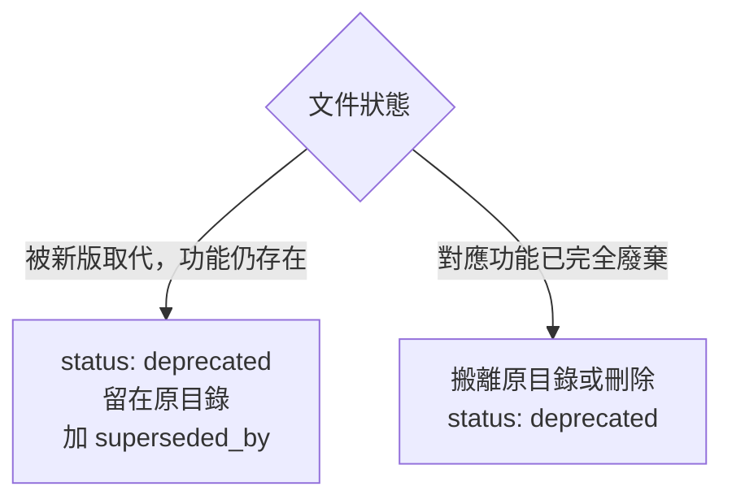

# Docs Governance

doc-viewer 文件治理技能。所有文件的建立、分類、frontmatter 填寫都依此執行。

## Step 1 — 判斷 doc_type

| doc_type | 用途 | 放哪裡 |
|---|---|---|
| `ULR` | 通用語言登錄（術語定義） | `docs/domain/ulr/` |
| `BCD` | 領域邊界定義 | `docs/domain/bcd/` |
| `BRS` | 商業需求規格 | `docs/product/brs/` |
| `SBE` | 實例化需求／BDD | `docs/product/sbe/` |
| `ADR` | 架構決策記錄 | `docs/engineering/adr/` |
| `TDR` | 技術選型決策 | `docs/engineering/tdr/` |
| `GUIDELINE` | 開發規範 | `docs/conventions/` |
| `IRR` | 事件根因記錄 | `docs/quality/incidents/` |
| `RUNBOOK` | 維運操作手冊 | `docs/operations/` |
| `AIDR` | AI 開發討論記錄 | `docs/discussions/` |
| `RPD` | 角色決議文件 | `docs/discussions/` |
| `BACKLOG` | 待辦事項匯整索引 | `docs/delivery/` |
| `CHANGE` | 計畫性功能變更交付記錄 | `docs/delivery/changes/` |
| `FIX` | 缺陷驅動修正交付記錄 | `docs/delivery/changes/` |

**建立順序原則：ULR → BCD → 其他所有類型**（語義地基必須最先建立）

## Step 2 — 填寫 Frontmatter

**必填欄位（無例外）：**

```yaml
---
doc_type: <見上表>
doc_id: <doc_type>-<YYYY-MM-DD>-<kebab-slug>
title: <文件標題，zh-TW，值含冒號時必須加雙引號>
status: draft
bounded_context: <所屬領域脈絡，例如 documentation-system>
version: 1
created_at: <YYYY-MM-DD>
last_reviewed: ~
source: <記錄來源，例如「與 Ean 的對話（YYYY-MM-DD）」>
ai_generated: true
---
```

**title 值含冒號時必須加引號：**
```yaml
# ❌ 錯誤——YAML 解析器會崩潰
title: Bug: 某問題描述

# ✅ 正確
title: "Bug: 某問題描述"
```

**狀態流程：**
```
draft → pending-review → verified → deprecated
              └──────────→ rejected
```

## Step 3 — 命名規則

```
docs/<目錄>/<doc_id>.md
```

例：
- `docs/engineering/adr/ADR-2026-06-08-use-vitepress.md`
- `docs/quality/incidents/IRR-2026-06-08-frontmatter-crash.md`
- `docs/domain/ulr/ULR-2026-06-01-core-terms.md`

## Step 4 — 視覺化優先原則

**能用 Mermaid 表達的結構，優先使用 Mermaid，不要用純文字描述。**

適合 Mermaid 的場景：
- 流程圖、決策樹 → `flowchart`
- 狀態機 → `stateDiagram-v2`
- 時序圖 → `sequenceDiagram`
- 實體關係 → `erDiagram`
- 甘特圖 → `gantt`


純文字描述（如「A 流向 B，再流向 C」）一律改為 Mermaid 圖。

---

## Step 5 — 文件結構（依 doc_type）


**ADR / TDR：**
```markdown
## 背景與問題
## 評估選項
## 決策
## 理由
## 影響與後續
## 相關文件
```

**IRR（事件根因記錄）：**
```markdown
## 事件摘要
## 時間線         ← markdown table：時間 | 事件
## 影響範圍       ← numbered list
## 根因分析       ← 第一層/第二層… 分層
## 修正行動       ← table：項目 | 狀態 | 說明
## 預防措施
## 相關文件

*本文件 v1 · YYYY-MM-DD · draft，待人工審核*
```

**GUIDELINE：**
```markdown
## 目的
## 範圍
## 規範內容
## 例外情況
## 相關文件
```

## Step 6 — 完成前檢查

- [ ] `doc_id` 與檔名一致
- [ ] `title` 值若含冒號已加雙引號
- [ ] `status: draft`（未審核前不得標為 verified）
- [ ] `bounded_context` 填寫（不得留空或填 `~`）
- [ ] 執行 `npm run docs:lint:schema` 確認無 frontmatter 錯誤

## Step 7 — 文件過期處置

**這兩個機制不是等價的，選錯會破壞可追溯性。**

### 情況 A：文件被新版取代 → `status: deprecated`，**留在原目錄**

適用於：
- 文件被新版本取代，但舊版本仍有參考或歷史價值
- 對應的功能仍然存在，只是規格或設計已演進

操作：
1. 舊文件：`status: deprecated`，加上 `superseded_by: <新文件 doc_id>`
2. 新文件：frontmatter 加上 `supersedes: <舊文件 doc_id>`
3. **不移動檔案** — 文件留在原目錄，sidebar 仍可找到，可追溯性不斷

```yaml
# 舊文件（原地保留）
status: deprecated
superseded_by: ADR-2026-06-09-new-decision
```

### 情況 B：對應功能已完全廢棄 → 搬離原目錄

適用於：
- 對應的功能已完全移除，或整個方向已放棄
- 文件與現有系統完全無關，留在原位只會造成混淆

操作：
1. 將檔案移至目標專案自訂的封存位置（例如 `docs/archive/` 或直接刪除）
2. frontmatter 加上 `status: deprecated`

**物理搬移後文件會從 sidebar 消失，應謹慎評估。若無明確封存需求，直接刪除即可。**

### 決策樹


