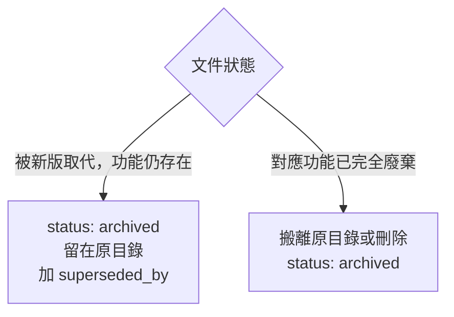

# Docs Governance

doc-viewer 文件治理技能。所有文件的建立、分類、frontmatter 填寫都依此執行。

## Step 1 — 判斷 domain 與 type

**`domain`**（必填，對應 `docs/` 下的頂層目錄，7 值）：

| domain | 用途 |
|---|---|
| `conventions` | 治理規範、開發標準（律法） |
| `product` | 產品策略、需求規格 |
| `engineering` | 技術架構、實作分析 |
| `quality` | 測試、評估、審查紀錄 |
| `delivery` | 排期、計畫、進度追蹤 |
| `operations` | 維運手冊、CI/CD |
| `reference` | 被動查詢用參考資料 |

詳細判定邏輯（律法/經驗/紀錄三分法）見 `docs/conventions/docs-governance/2026-06-14-docs-classification-logic.md`。

**`type`**（必填，開放詞彙，描述文件性質）：

| 類別 | 常見 type 值 |
|---|---|
| 律法 | `guideline`, `convention` |
| 經驗 | `guide`, `playbook`, `runbook` |
| 紀錄 | `assessment`, `decision`, `plan`, `feedback`, `discussion`, `spec`, `checklist`, `rpd` |
| 規格/領域模型 | `adr`, `tdr`, `irr`, `ulr`, `bcd`, `brs`, `sbe` |

不確定時選最接近的既有值；不要自創與既有詞彙意義重疊的新值。若文件涉及領域模型定義（`ulr`/`bcd`），建議優先於同主題的其他文件之前建立，作為語義地基。

## Step 2 — 填寫 Frontmatter

**必填欄位（無例外）：**

```yaml
---
title: <文件標題，zh-TW，值含冒號時必須加雙引號>
domain: <見 Step 1>
type: <見 Step 1>
status: draft
owner: <person/team，例如 tech-team 或 Ean>
updated: <YYYY-MM-DD>
source_of_truth: true | false
---
```

**title 值含冒號時必須加引號：**
```yaml
# ❌ 錯誤——YAML 解析器會崩潰
title: Bug: 某問題描述

# ✅ 正確
title: "Bug: 某問題描述"
```

**status 三階流程：**
```
draft → approved → archived
```
- `draft`：草稿，未審核
- `approved`：已審核通過，現行有效
- `archived`：已過期或被取代，留存供追溯

**`source_of_truth`**：同一主題若有多份文件，僅一份標記為 `true`；其餘標記 `false`，並以 `supersedes` / `superseded_by` 互相關聯。

## Step 3 — 命名規則

依文件性質採用對應命名格式（詳見 `docs/conventions/docs-governance/2026-06-14-doc-maintenance-workflow.md` 第 3 節）：
- 核心律法：`YYYY-MM-DD-kebab-description.md`
- 技術指南/經驗：`kebab-case-description.md`
- 分析紀錄：保留日期前綴，如 `2026-01-29-performance-report.md`

**檔名 ↔ frontmatter `title` ↔ `type` ↔ 正文 `H1` 四者必須同步對齊**（四維同步，見上述文件第 1 節）。

## Step 4 — 視覺化優先原則

**能用 Mermaid 表達的結構，優先使用 Mermaid，不要用純文字描述。**

適合 Mermaid 的場景：
- 流程圖、決策樹 → `flowchart`
- 狀態機 → `stateDiagram-v2`
- 時序圖 → `sequenceDiagram`
- 實體關係 → `erDiagram`
- 甘特圖 → `gantt`


純文字描述（如「A 流向 B，再流向 C」）一律改為 Mermaid 圖。

---

## Step 5 — 文件結構（依 type）

**`adr` / `tdr`：**
```markdown
## 背景與問題
## 評估選項
## 決策
## 理由
## 影響與後續
## 相關文件
```

**`irr`（事件根因記錄）：**
```markdown
## 事件摘要
## 時間線         ← markdown table：時間 | 事件
## 影響範圍       ← numbered list
## 根因分析       ← 第一層/第二層… 分層
## 修正行動       ← table：項目 | 狀態 | 說明
## 預防措施
## 相關文件

*本文件 v1 · YYYY-MM-DD · draft，待人工審核*
```

**`guideline`：**
```markdown
## 目的
## 範圍
## 規範內容
## 例外情況
## 相關文件
```

## Step 6 — 完成前檢查

- [ ] 檔名 ↔ `title` ↔ `type` ↔ H1 四維對齊
- [ ] `title` 值若含冒號已加雙引號
- [ ] `status: draft`（未審核前不得標為 `approved`）
- [ ] `domain` / `type` / `owner` / `updated` / `source_of_truth` 均已填寫
- [ ] 若為取代既有文件，確認 `source_of_truth` 與 `supersedes` / `superseded_by` 已正確標記
- [ ] 執行 `npm run docs:lint:schema` 確認無 frontmatter 錯誤

## Step 7 — 文件過期處置

**這兩個機制不是等價的，選錯會破壞可追溯性。**

### 情況 A：文件被新版取代 → `status: archived`，**留在原目錄**

適用於：
- 文件被新版本取代，但舊版本仍有參考或歷史價值
- 對應的功能仍然存在，只是規格或設計已演進

操作：
1. 舊文件：`status: archived`，加上 `superseded_by: <新文件路徑或 doc_id>`
2. 新文件：frontmatter 加上 `supersedes: <舊文件路徑或 doc_id>`、`source_of_truth: true`
3. **不移動檔案** — 文件留在原目錄，sidebar 仍可找到，可追溯性不斷

```yaml
# 舊文件（原地保留）
status: archived
superseded_by: docs/engineering/adr/2026-06-09-new-decision.md
```

### 情況 B：對應功能已完全廢棄 → 搬離原目錄

適用於：
- 對應的功能已完全移除，或整個方向已放棄
- 文件與現有系統完全無關，留在原位只會造成混淆

操作：
1. 將檔案移至目標專案自訂的封存位置，或直接刪除
2. frontmatter 加上 `status: archived`

**物理搬移後文件會從 sidebar 消失，應謹慎評估。若無明確封存需求，直接刪除即可。**

### 決策樹



## Step 8 — GUIDELINE ↔ Skill 同步檢查（Retro）

`docs/conventions/` 下的 GUIDELINE 是開發規範的**單一來源**；`.claude/CLAUDE.md` 與各 skill 是衍生給 AI agent 的操作規則。兩者必須保持一致，避免重新出現「同一規則在多處重複定義、甚至互相矛盾」的問題（例如 GUIDELINE-2026-06-13-git-branching.md 修正前，root `DEVELOPMENT.md` 用 `bugfix/*`、`CLAUDE.md`/skill 用 `fix/*` 的矛盾案例）。

### 觸發時機

- **修改任何 GUIDELINE 文件後**：立即檢查 `.claude/CLAUDE.md` 與相關 skill 是否有對應段落需同步更新
- **新增或修改 skill 時**：檢查內容是否與既有 GUIDELINE 一致；若 skill 引入了新規範，應同步補進對應 GUIDELINE（GUIDELINE 為準）
- **定期排程觸發**（見下方）：即使沒有手動修改，也要檢查兩者是否已產生隱性偏差

### 檢查清單

- [ ] 列出 `docs/conventions/*.md` 與 `.claude/CLAUDE.md`、`.claude/skills/**/SKILL.md` 中涵蓋相同主題的段落
- [ ] 逐項比對：規則內容是否一致（例如分支命名、commit scope、enum 規範）
- [ ] 發現矛盾 → 以 GUIDELINE 為準，修正 CLAUDE.md/skill；若 GUIDELINE 本身已過時，先更新 GUIDELINE（`status` 走 `draft → approved → archived`）
- [ ] 發現 GUIDELINE 已涵蓋但 CLAUDE.md/skill 未指回 → 補上指向連結，移除重複內容
- [ ] 確認 `.claude/CLAUDE.md`「參考文件」等連結未指向不存在的檔案

### 排程提醒

建議以 `loop` skill 或 `scheduled-tasks` 設定**每月一次**的排程，內容為：「依 docs-governance skill Step 8 執行 GUIDELINE ↔ CLAUDE.md/skill 同步檢查，回報發現的偏差」。
